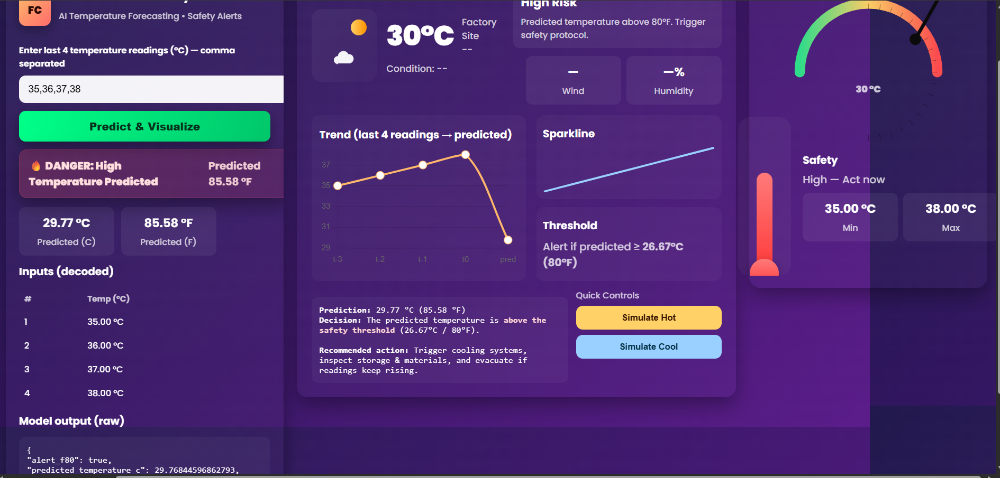

  <!-- 🔝 Dashboard Image -->
  

    
  

  <h1>🌡️ AI Temperature Forecasting & Safety Alert System</h1>

  

    An <b>AI-powered temperature forecasting system</b> built using
    <b>Python, Machine Learning, and Flask</b>.  
    The system predicts future temperature values based on the
    <b>last 4 temperature readings (°C)</b> and provides
    <b>visual insights, safety alerts, and risk monitoring</b>
    through an interactive web dashboard 📊🚨.
  

  

  <h2>🚀 Project Overview</h2>
  

    This project forecasts <b>future temperature trends</b> using historical input values and classifies conditions into:
  

  <ul>
    <li>✅ Normal</li>
    <li>⚠️ Risk</li>
    <li>🔥 High Risk</li>
  </ul>
  

    Designed for <b>industrial safety, climate monitoring, and AI learning</b> 🏭🌍🤖.
  

  

  <h2>🔑 Key Highlights</h2>
  <ul>
    <li>🌡️ Accepts 4 recent temperature readings (°C)</li>
    <li>🔮 Predicts future temperature</li>
    <li>🔁 Converts output to Celsius, Fahrenheit & Kelvin</li>
    <li>🚨 Risk alerts (True / False)</li>
    <li>📈 Trend graph & sparkline visualization</li>
    <li>🧭 Safety gauge & compass</li>
    <li>🖥️ Flask-based interactive dashboard</li>
    <li>🧠 ML-powered forecasting</li>
  </ul>

  

  <h2>🧠 How It Works</h2>
  <ol>
    <li>👤 User enters 4 temperature values (°C)</li>
    <li>⚙️ Backend processes input via ML model</li>
    <li>📊 Model predicts upcoming temperature</li>
    <li>🛡️ System converts units, checks threshold & generates alerts</li>
  </ol>

  

  <h2>📊 Safety Logic</h2>
  <ul>
    <li>⚠️ Threshold: <b>26.67°C (80°F)</b></li>
    <li>Predicted ≥ threshold → 🚨 Alert = True</li>
    <li>Else → ✅ Safe condition</li>
  </ul>

  

  <h2>🛠️ Technologies Used</h2>
  
Flask

  
Flask-CORS

  
Joblib

  
NumPy

  
Pandas

  
Scikit-learn

  
XGBoost

  
Matplotlib

  
Seaborn

  
Pytest

  

  <h2>⚙️ Installation & Setup</h2>
  <pre>
git clone https://github.com/your-username/temperature-forecasting-ai.git
cd temperature-forecasting-ai
pip install -r requirements.txt
python app.py
  </pre>

  
🌐 Open in browser: <code>http://127.0.0.1:5000/</code>

  

  <h2>🧪 Sample Input</h2>
  <pre>35, 36, 37, 38</pre>

  <h2>📤 Sample Output</h2>
  <ul>
    <li>🌡️ Predicted Temperature: <b>29.77°C</b></li>
    <li>🚨 Alert: <b>True</b></li>
    <li>🔥 Risk Level: <b>High Risk</b></li>
  </ul>

  

    ⭐ Built with ❤️ using Python, Machine Learning & Flask  
     Promoting AI-driven safety systems 🌍🤖
  

</body>
</html>
